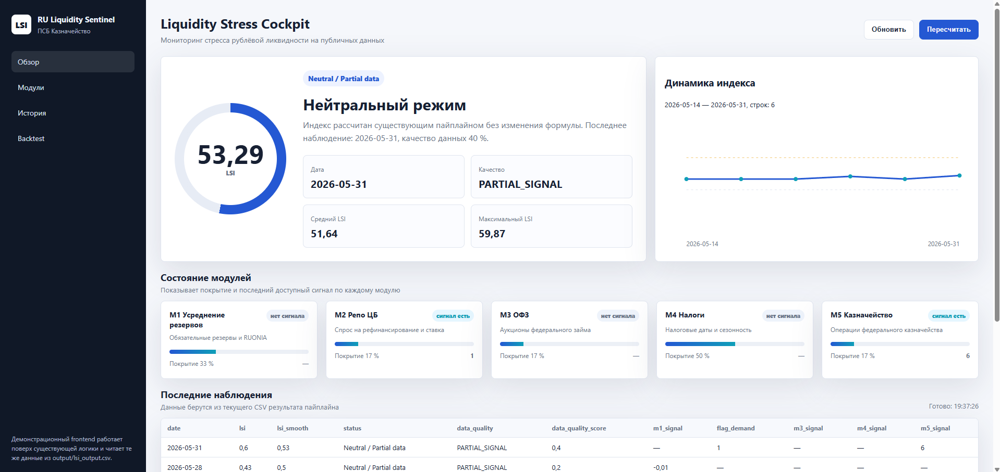

# RU Liquidity Sentinel

Early warning system for ruble money market liquidity stress.

## Run
```bash
pip install -r requirements.txt
python pipeline.py
python -m streamlit run app.py
python backend_service.py // для запуска визуализации данных в браузере
```

# Liquidity Stress Index (LSI)

Проект строит **Liquidity Stress Index (LSI)** — сводный индикатор напряжённости ликвидности на денежном рынке по набору частичных и разреженных источников данных.  
Пайплайн собирает данные из нескольких источников, преобразует их в отдельные сигналы `m1`–`m5`, затем агрегирует их в общий индекс с учётом качества данных и весов.

## Что делает проект

Проект предназначен для ежедневного расчёта индекса ликвидности на основе:
- банковских и денежно-рыночных показателей;
- результатов repo-аукционов;
- OFZ-аукционов;
- налогового календаря;
- казначейских публикаций.

Идея в том, чтобы индекс **не ломался**, даже если часть источников временно недоступна или пустая, а вместо этого продолжал строиться по тем данным, которые есть.  
Это особенно важно для реальных финансовых пайплайнов, где входные ряды часто бывают неполными или обновляются нерегулярно.

## Как устроен пайплайн

Пайплайн работает в три этапа:
1. Сбор сырых данных из внешних источников.
2. Преобразование их в сигналы `m1`–`m5`.
3. Агрегация сигналов в итоговый `LSI` с расчётом качества данных.

Если один источник пустой, пайплайн не падает.  
Если сигнал отсутствует, он просто не участвует в текущей строке, а итоговый индекс всё равно считается по доступным данным. Это сделано специально, чтобы проект был устойчивым к неполной информации.

## Источники данных

Ниже — основные источники, которые использует проект.

| Источник | Что берём | Роль в модели |
|---|---|---|
| CBR / Банк России | RUONIA, repo-аукционы, ключевая ставка, обязательные резервы | Базовый денежный и ликвидностный фон |
| Минфин России | OFZ-аукционы | Рынок госдолга и косвенное давление на ликвидность |
| ФНС | Налоговый календарь | Краткосрочные налоговые оттоки |
| Казначейство России | Казначейские размещения / депозиты | Потоки ликвидности со стороны государства |

Если источник не отдаёт таблицу или возвращает пустую страницу, сборщик возвращает пустой `DataFrame`, а не ошибку.  
Это позволяет запускать пайплайн стабильно даже в дни с неполными данными.

## Сигналы модуля

Проект разбивает входные данные на пять модулей:

- `m1` — базовый сигнал по резервам / RUONIA.
- `m2` — repo-сигнал, который отражает спрос на ликвидность на денежном рынке.
- `m3` — OFZ-сигнал, построенный по аукционам ОФЗ.
- `m4` — налоговый сигнал, основанный на календаре налоговых событий.
- `m5` — казначейский сигнал, отражающий влияние операций казначейства.

Сигналы сделаны в едином формате: `date` + числовое значение.  
Это позволяет легко добавлять новые источники без переписывания архитектуры агрегации.

## Логика весов

Итоговый LSI строится не как простая сумма, а как **взвешенная агрегация** сигналов.  
Веса отражают экономическую близость каждого сигнала к ликвидности: чем прямее фактор связан с денежным рынком, тем выше его вес.

Текущая логика весов такая:

- `m2` — 0.40.
- `m1` — 0.30.
- `m5` — 0.15.
- `m3` — 0.10.
- `m4` — 0.05.

### Почему именно так

`m2` получает наибольший вес, потому что repo-аукционы и спред к ключевой ставке — это самый прямой индикатор напряжения ликвидности.  
`m1` идёт следом, потому что базовые банковские резервы и RUONIA связаны с фундаментальной ликвидностью системы.  
`m5` важен, но косвенно, поскольку казначейские операции влияют на рынок через приток или изъятие средств.  
`m3` и `m4` оставлены как вспомогательные сигналы: OFZ и налоговые события действительно воздействуют на ликвидность, но обычно не определяют её полностью сами по себе.

## Обработка качества данных

Поскольку источники часто бывают неполными, проект отдельно считает `data_quality_score`.  
Этот показатель показывает, какая доля сигналов реально присутствует в конкретной строке индекса.

Сейчас логика такая:
- если доступен 1 из 5 сигналов, качество ниже;
- если доступно 2 из 5, качество выше;
- если источников больше, показатель растёт.

Параллельно в CSV есть поле `data_quality`, которое обычно принимает значения:
- `PARTIAL_SIGNAL`,
- `NO_SIGNAL`.  

Это позволяет сразу видеть, насколько надёжна текущая строка индекса.

## Формат выходных данных

Итог сохраняется в `output/lsi_output.csv`.  
Обычно в нём есть такие колонки:

- `date`.
- `m1_signal`.
- `cover_ratio`.
- `rate_spread`.
- `mad_cover`.
- `mad_rate_spread`.
- `flag_demand`.
- `m3_signal`.
- `m4_signal`.
- `m5_signal`.
- `lsi_raw`.
- `lsi`.
- `lsi_smooth`.
- `status`.
- `data_quality`.
- `data_quality_score`.
`lsi_raw` — это сырой взвешенный индекс до сжатия.  
`lsi` — логистически преобразованная версия в диапазоне 0..1.  
`lsi_smooth` — сглаженная версия, которая уменьшает шум на разреженных датах.

## Как читать результат

Интерпретация простая:
- значения ближе к 0 означают слабый или отрицательный сигнал ликвидности;
- значения около 0.5 — нейтральный режим;
- значения выше 0.6 — более выраженный положительный сигнал.

При этом статус зависит не только от самого `lsi`, но и от `lsi_smooth`, потому что проект работает с неполной и неравномерной временной сеткой.  
Это сделано для того, чтобы индекс был устойчивым, а не реагировал слишком резко на один-два редких сигнала.

## Пайплайн

1. скачивает данные;
2. строит сигналы;
3. объединяет их по датам;
4. рассчитывает `LSI`;
5. сохраняет итоговый CSV в `output/lsi_output.csv`.

## Ограничения

На текущем этапе проект ещё зависит от качества парсинга внешних страниц.  
Если какой-то источник меняет верстку или перестаёт отдавать таблицу, соответствующий модуль может временно стать пустым. Но это не критично: архитектура уже позволяет продолжать расчёт по остальным источникам.

## Почему индекс пока нейтральный

На текущих данных большинство строк остаются в нейтральной зоне, потому что:
- история короткая;
- источники разрежены;
- часть сигналов появляется только на отдельных датах;
- `m1` пока работает в fallback-режиме.

***

## Визуализация метрик

